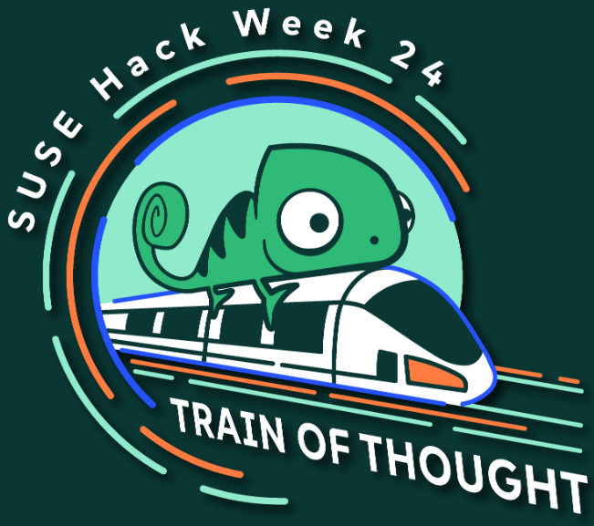
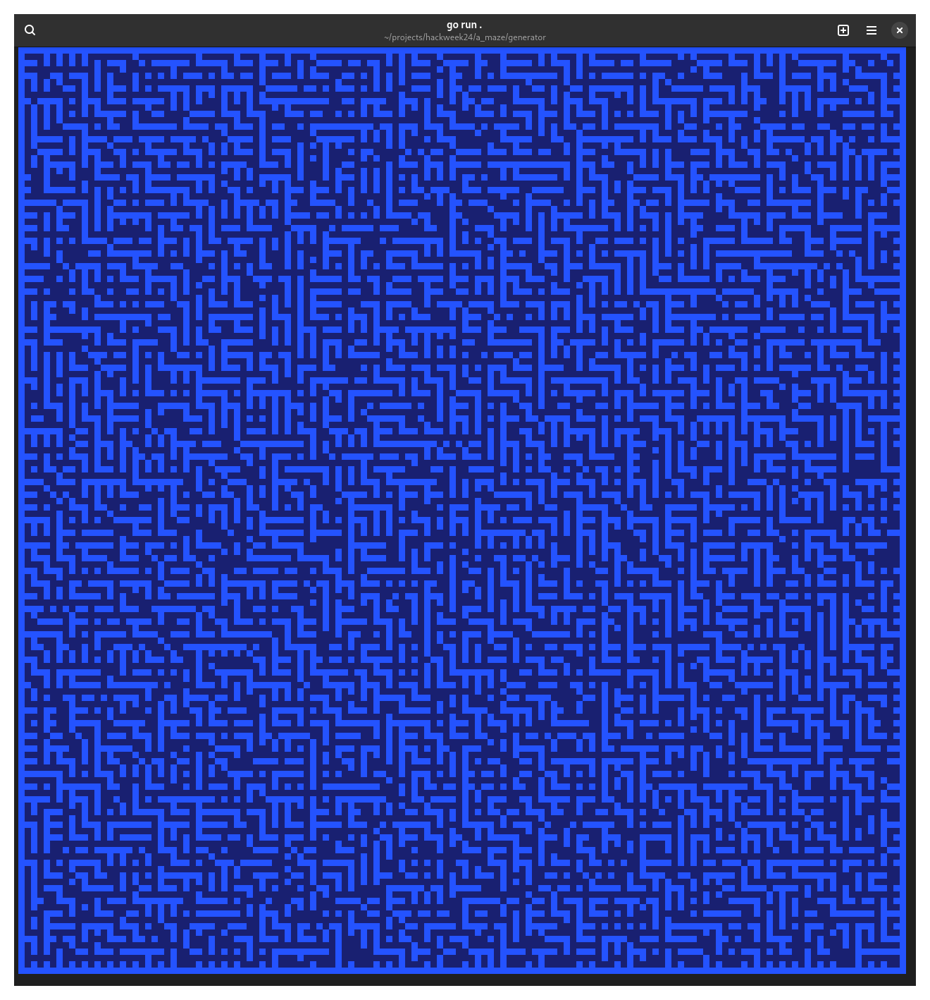
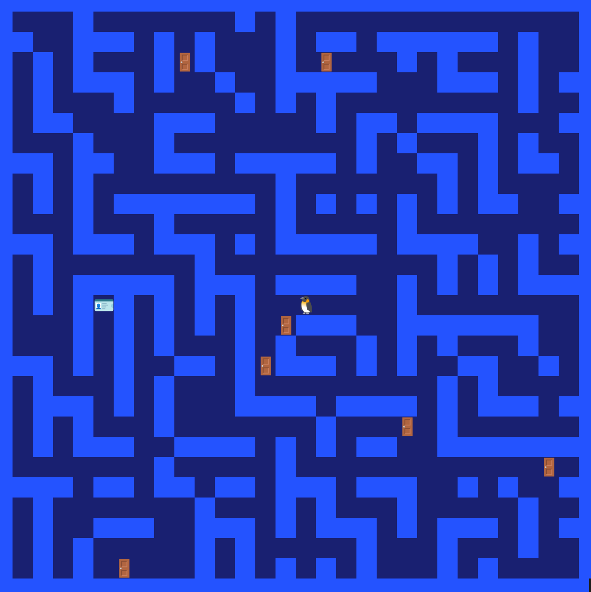
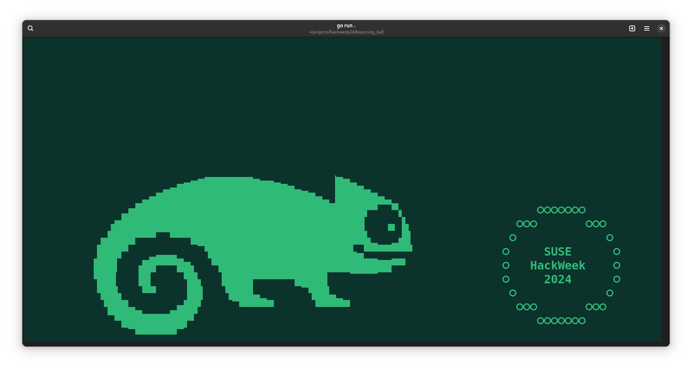
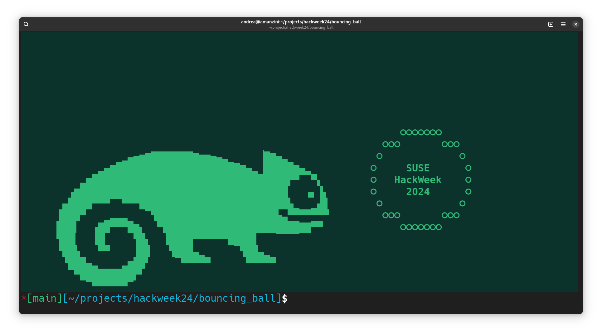
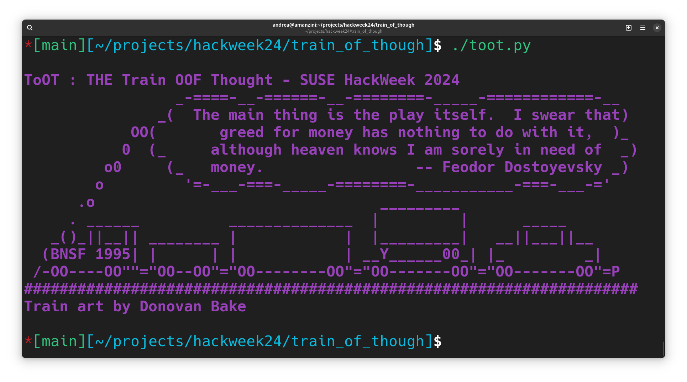
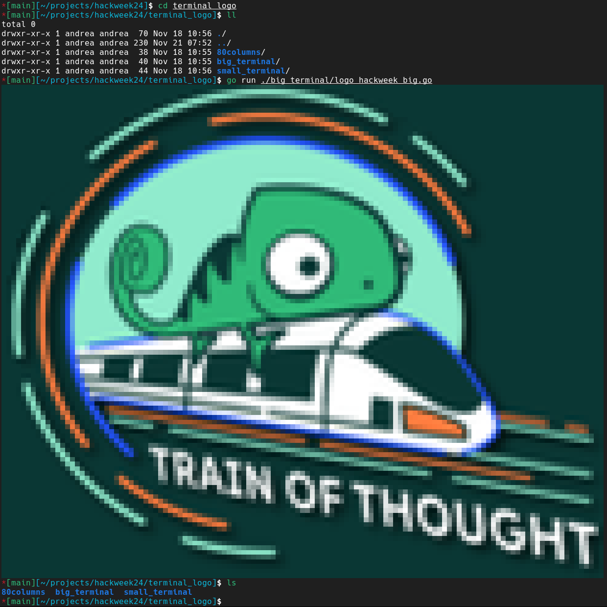

## Hello

This repository contains experiments and material for [my HackWeek24 project](https://hackweek.opensuse.org/24/projects/hack-on-rich-terminal-user-interfaces).



Prerequisites:
- a Go compiler toolchain installed

On openSUSE, this means:

```
$ sudo zypper install go
```

For each folder, you can simply `go run .` to execute the program (or `go program.go` if there is only one file)

You can find other projects and details about HackWeek [here](https://hackweek.opensuse.org)

## Some screenshots

- double-res maze generator


- interactive maze game


- 60 pfs animation of a bouncing ball with sprite priority



- TooT - train of thoughts


- Hackweek logo rendered using text mode fixed width font


